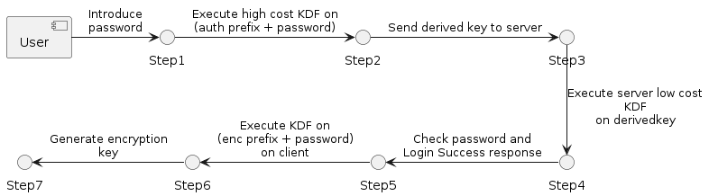

# Secure Vault Project

//TODO Create table of contents (https://youtu.be/6V5yaVhK_hE)
## Introduction

The aim of this project has been to create a library that can be installed and used on the client side of a web-application in order to apply PBKDF over passwords and encrypt/decrypt data in a transparent way for the client. In order to do this, a more powerful KDF has been used (scrypt) on the client side. To achieve this, a series of points have been developed to demonstrate the functionalities of the library in a realistic environment.

- Development of a library that acts as a black box where the client has specific functions that it can call. These are the ones that execute all the necessary steps to apply the PBDFK on passwords, communicate with the server and encrypt/decrypt data on the client side.
- Develop a web application, in which the library is used and can be seen to work correctly. This application has also to simulate a secure vault where the user can upload encrypted data and see the content decrypted on the browser.
- Implementation of the backend server, which contains all the necessary endpoints to persist data, return information requested by the client or store data in the Google Cloud Storage. All this together with different PassportJS strategies with the configuration for authentication or authorization requests.
- Add Server Sent Events (SSE) in order to update with the uploaded content in the server on all devices to keep them in sync with each other.

## Design
For the design of the project, we start from the premise that there is a client, a server and a cloud storage. The client needs to be able to upload encrypted data to the cloud storage. The key part here is that the content stored on the cloud can only be decrypted on the client side. In addition, the client can also generate derived keys so that neither the server nor the cloud storage provider can know the original password. On the other side, the server simply has to handle all the endpoints and execute the necessary actions expected by the client. The server also needs to update the client content on all connected devices each time data is updated on the cloud.

Because it is wanted the server to be blind in relation to the information being stored (documents or passwords), some parts of the key derivation and all data encryption must be defined on the client. In the following figure we can see the protocol followed to generate the derived keys.

    
    
<b>Fig 1. Password key derivation protocol</b>

